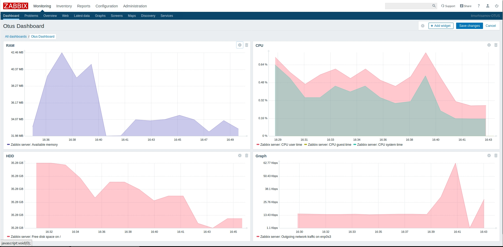
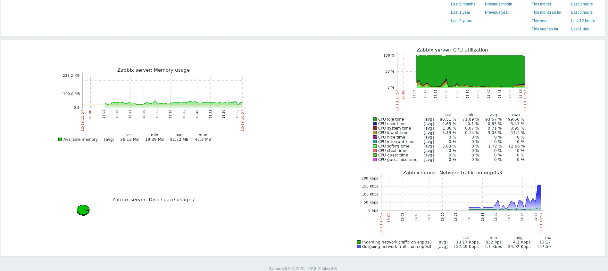

#   Мониторинг и алертинг

*zabbix-dashboard.png* # настроенный дашборд

*zabbix-screen.png* # настроенный экран

*zabbix-grafana.png*  # grafana в связке с zabbix-server

*Vagrantfile* # конфигурация виртуальных машин

Реализовано в домашнем задании:

- развернут сервер с нуля, используется СУБД postgresql

- подключен клиент
