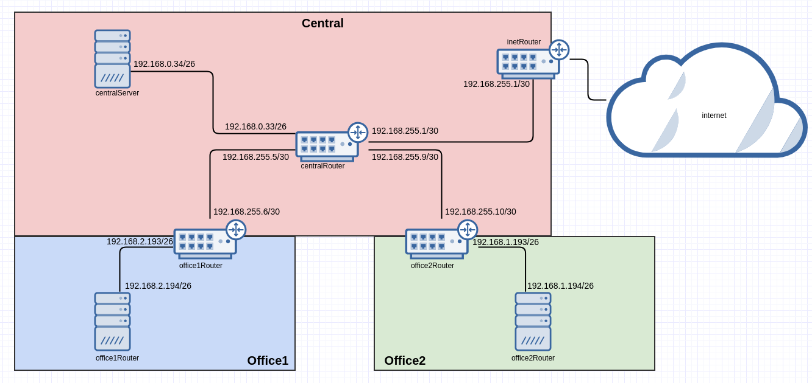

# Архитектура сетей

## Теоретическая часть

### найти свободные подсети

| name | network | bitmask | netmask | broadcast | hosts |
| ------ | ------ | ------ | ------ | ------ | ------ |
| central | 192.168.0.16 | 28 | 255.255.255.240 | 192.168.0.31 | 14 |
|   | 192.168.0.48 | 28 | 255.255.255.240 | 192.168.0.63 | 14 |
|   | 192.168.0.218 | 25 | 255.255.255.128 | 192.168.0.255| 126 |

### посчитать сколько узлов в каждой подсети, включая свободные

| name | network | bitmask | netmask | broadcast | hosts | description |
| ------ | ------ | ------ | ------ | ------ | ------ | ------ |
| office1 | 192.168.2.0 | 26 | 255.255.255.192 | 192.168.2.63 | 62 | dev |
|  | 192.168.2.64 | 26 | 255.255.255.192 | 192.168.2.127 | 62 | test servers |
|  | 192.168.2.128 | 26 | 255.255.255.192 | 192.168.2.191 | 62 | managers |
|  | 192.168.2.192 | 26 | 255.255.255.192 | 192.168.2.255 | 62 | office hardware |
| office2 | 192.168.1.0 | 25 | 255.255.255.128 | 192.168.1.127 | 126 | dev |
|  | 192.168.1.128 | 26 | 255.255.255.192 | 192.168.1.191 | 62 | test servers |
|  | 192.168.1.192 | 26 | 255.255.255.192 | 192.168.2.255 | 62 | office hardware |
| central | 192.168.0.0 | 28 | 255.255.255.240 | 192.168.0.15 | 14 | directors |
|  | 192.168.0.32 | 28 | 255.255.255.240 | 192.168.0.47 | 14 | office hardware |
|  | 192.168.0.64 | 26 | 255.255.255.192 | 192.168.0.127 | 62 | wifi |

### указать broadcast адрес для каждой подсети

указан в таблице выше

### проверить нет ли ошибок при разбиении

ошибок нет

## Практическая часть

- соединить офисы в сеть согласно схеме и настроить роутинг

- все сервера и роутеры должны ходить в инет черз inetRouter

- все сервера должны видеть друг друга

- у всех новых серверов отключить дефолт на нат (eth0), который вагрант поднимает для связи

- при нехватке сетевых интерфейсов добавить по несколько адресов на интерфейс

## Схема сети:

