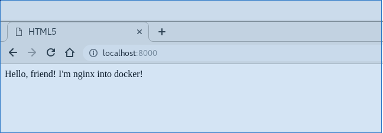
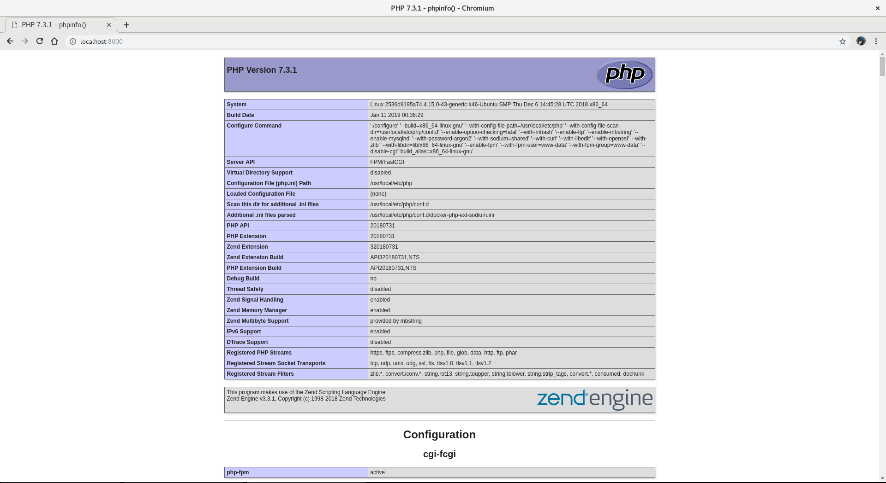

#   18. Docker

## Задание

### Создайте свой кастомный образ nginx на базе alpine. После запуска nginx должен отдавать кастомную страницу (достаточно изменить дефолтную страницу nginx)

### Определите разницу между контейнером и образом

|   | image | container |
| ------ | ------ | ------ |
| ядро | + | - |
| возможность эмулиции различных ОС (unix, win) | + | - |
| изулоция окружения | + | + |
| место на диске | больше | меньше |
| эмуляция оборудования | + | - |
| производительность | меньше | больше (за счет отсутствия виртуализации оборудования) |

### Вывод опишите в домашнем задании

Когда можно использовать виртуализацию:

- предоставление сервиса, зависищего от аппаратного обеспечения

- требуется ОС, отличная от установленной

В остальных случаях используем контейнеры.

### Ответьте на вопрос: Можно ли в контейнере собрать ядро?

Собрать ядро можно, запустить и использовать - нет

### Собранный образ необходимо запушить в docker hub и дать ссылку на ваш репозиторий

[timurhisamov/otus:0.3](https://cloud.docker.com/u/timurhisamov/repository/docker/timurhisamov/otus)

## Задание со * (звездочкой)

### Создайте кастомные образы nginx и php, объедините их в docker-compose

*/nginx-php/docker-compose.yml*

### После запуска nginx должен показывать php info

### Все собранные образы должны быть в docker hub
