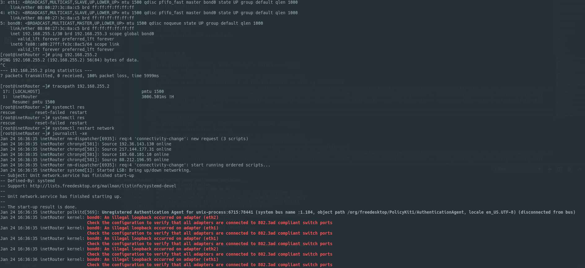

# Сетевые пакеты. VLAN'ы. LACP. 

## Домашнее задание

Для проверки vlan:

```bash
vagrant up office1Router testClient1 testClient2 testServer1 testServer2    
```

Для проверки bonding (rr):

```bash
vagrant up inetRouter centralRouter   
```

### LACP поднять не получилось, journalctl -xe выдает: 

<details><summary>скриншот</summary>
<p>



</p>
</details>

<details><summary>cat /proc/net/bonding/bond0</summary>
<p>

```bash
[root@inetRouter ~]# cat /proc/net/bonding/bond0 
Ethernet Channel Bonding Driver: v3.7.1 (April 27, 2011)

Bonding Mode: IEEE 802.3ad Dynamic link aggregation
Transmit Hash Policy: layer2 (0)
MII Status: up
MII Polling Interval (ms): 100
Up Delay (ms): 0
Down Delay (ms): 0

802.3ad info
LACP rate: fast
Min links: 0
Aggregator selection policy (ad_select): stable
System priority: 65535
System MAC address: 08:00:27:50:f4:97
Active Aggregator Info:
	Aggregator ID: 1
	Number of ports: 1
	Actor Key: 9
	Partner Key: 1
	Partner Mac Address: 00:00:00:00:00:00

Slave Interface: eth1
MII Status: up
Speed: 1000 Mbps
Duplex: full
Link Failure Count: 0
Permanent HW addr: 08:00:27:50:f4:97
Slave queue ID: 0
Aggregator ID: 1
Actor Churn State: monitoring
Partner Churn State: monitoring
Actor Churned Count: 0
Partner Churned Count: 0
details actor lacp pdu:
    system priority: 65535
    system mac address: 08:00:27:50:f4:97
    port key: 9
    port priority: 255
    port number: 1<details><summary>
    port state: 207
details partner lacp pdu:
    system priority: 65535
    system mac address: 00:00:00:00:00:00
    oper key: 1
    port priority: 255
    port number: 1
    port state: 3

Slave Interface: eth2
MII Status: up
Speed: 1000 Mbps
Duplex: full
Link Failure Count: 0
Permanent HW addr: 08:00:27:a1:13:97
Slave queue ID: 0
Aggregator ID: 2
Actor Churn State: monitoring
Partner Churn State: monitoring
Actor Churned Count: 0
Partner Churned Count: 0
details actor lacp pdu:
    system priority: 65535
    system mac address: 08:00:27:50:f4:97
    port key: 9
    port priority: 255
    port number: 2
    port state: 199
details partner lacp pdu:
    system priority: 65535
    system mac address: 00:00:00:00:00:00
    oper key: 1
    port priority: 255
    port number: 1
    port state: 3
```

</p>
</details>
