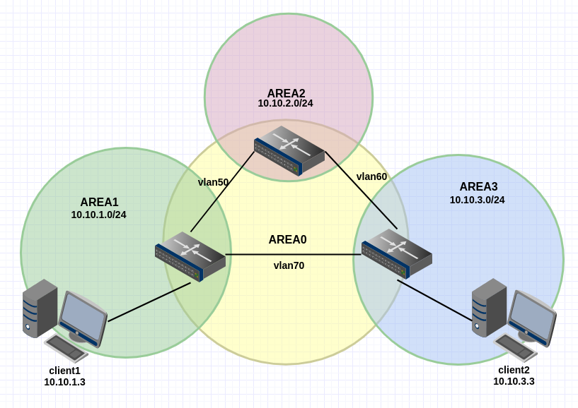

# Статическая и динамическая маршрутизация

## Домашнее задание

## Схема подключения: 



<p>

### vm1

```bash
[vagrant@vm1 ~]$ ip a
1: lo: <LOOPBACK,UP,LOWER_UP> mtu 65536 qdisc noqueue state UNKNOWN group default qlen 1000
    link/loopback 00:00:00:00:00:00 brd 00:00:00:00:00:00
    inet 127.0.0.1/8 scope host lo
       valid_lft forever preferred_lft forever
    inet6 ::1/128 scope host 
       valid_lft forever preferred_lft forever
2: eth0: <BROADCAST,MULTICAST,UP,LOWER_UP> mtu 1500 qdisc pfifo_fast state UP group default qlen 1000
    link/ether 52:54:00:f0:e9:5b brd ff:ff:ff:ff:ff:ff
    inet 10.0.2.15/24 brd 10.0.2.255 scope global noprefixroute dynamic eth0
       valid_lft 85900sec preferred_lft 85900sec
    inet6 fe80::5054:ff:fef0:e95b/64 scope link 
       valid_lft forever preferred_lft forever
3: eth1: <BROADCAST,MULTICAST,UP,LOWER_UP> mtu 1500 qdisc pfifo_fast state UP group default qlen 1000
    link/ether 08:00:27:e1:b8:d8 brd ff:ff:ff:ff:ff:ff
    inet6 fe80::a00:27ff:fee1:b8d8/64 scope link 
       valid_lft forever preferred_lft forever
4: eth2: <BROADCAST,MULTICAST,UP,LOWER_UP> mtu 1500 qdisc pfifo_fast state UP group default qlen 1000
    link/ether 08:00:27:b1:3e:4c brd ff:ff:ff:ff:ff:ff
    inet 10.10.1.254/24 brd 10.10.1.255 scope global noprefixroute eth2
       valid_lft forever preferred_lft forever
    inet6 fe80::a00:27ff:feb1:3e4c/64 scope link 
       valid_lft forever preferred_lft forever
5: eth1.50@eth1: <BROADCAST,MULTICAST,UP,LOWER_UP> mtu 1500 qdisc noqueue state UP group default qlen 1000
    link/ether 08:00:27:e1:b8:d8 brd ff:ff:ff:ff:ff:ff
    inet 192.168.50.2/24 brd 192.168.50.255 scope global eth1.50
       valid_lft forever preferred_lft forever
    inet6 fe80::a00:27ff:fee1:b8d8/64 scope link 
       valid_lft forever preferred_lft forever
6: eth1.70@eth1: <BROADCAST,MULTICAST,UP,LOWER_UP> mtu 1500 qdisc noqueue state UP group default qlen 1000
    link/ether 08:00:27:e1:b8:d8 brd ff:ff:ff:ff:ff:ff
    inet 192.168.70.3/24 brd 192.168.60.255 scope global eth1.70
       valid_lft forever preferred_lft forever
    inet6 fe80::a00:27ff:fee1:b8d8/64 scope link 
       valid_lft forever preferred_lft forever
```

</p>

<p>

### vm2

```bash
[vagrant@vm2 ~]$ ip a
1: lo: <LOOPBACK,UP,LOWER_UP> mtu 65536 qdisc noqueue state UNKNOWN group default qlen 1000
    link/loopback 00:00:00:00:00:00 brd 00:00:00:00:00:00
    inet 127.0.0.1/8 scope host lo
       valid_lft forever preferred_lft forever
    inet6 ::1/128 scope host 
       valid_lft forever preferred_lft forever
2: eth0: <BROADCAST,MULTICAST,UP,LOWER_UP> mtu 1500 qdisc pfifo_fast state UP group default qlen 1000
    link/ether 52:54:00:f0:e9:5b brd ff:ff:ff:ff:ff:ff
    inet 10.0.2.15/24 brd 10.0.2.255 scope global noprefixroute dynamic eth0
       valid_lft 85982sec preferred_lft 85982sec
    inet6 fe80::5054:ff:fef0:e95b/64 scope link 
       valid_lft forever preferred_lft forever
3: eth1: <BROADCAST,MULTICAST,UP,LOWER_UP> mtu 1500 qdisc pfifo_fast state UP group default qlen 1000
    link/ether 08:00:27:20:0a:cd brd ff:ff:ff:ff:ff:ff
    inet6 fe80::a00:27ff:fe20:acd/64 scope link 
       valid_lft forever preferred_lft forever
4: eth2: <BROADCAST,MULTICAST,UP,LOWER_UP> mtu 1500 qdisc pfifo_fast state UP group default qlen 1000
    link/ether 08:00:27:21:be:3c brd ff:ff:ff:ff:ff:ff
    inet 10.10.2.254/24 brd 10.10.2.255 scope global noprefixroute eth2
       valid_lft forever preferred_lft forever
    inet6 fe80::a00:27ff:fe21:be3c/64 scope link 
       valid_lft forever preferred_lft forever
5: eth1.50@eth1: <BROADCAST,MULTICAST,UP,LOWER_UP> mtu 1500 qdisc noqueue state UP group default qlen 1000
    link/ether 08:00:27:20:0a:cd brd ff:ff:ff:ff:ff:ff
    inet 192.168.50.3/24 brd 192.168.50.255 scope global eth1.50
       valid_lft forever preferred_lft forever
    inet6 fe80::a00:27ff:fe20:acd/64 scope link 
       valid_lft forever preferred_lft forever
6: eth1.60@eth1: <BROADCAST,MULTICAST,UP,LOWER_UP> mtu 1500 qdisc noqueue state UP group default qlen 1000
    link/ether 08:00:27:20:0a:cd brd ff:ff:ff:ff:ff:ff
    inet 192.168.60.2/24 brd 192.168.60.255 scope global eth1.60
       valid_lft forever preferred_lft forever
    inet6 fe80::a00:27ff:fe20:acd/64 scope link 
       valid_lft forever preferred_lft forever
```

</p>

<p>

### vm3

```bash
[vagrant@vm3 ~]$ ip a
1: lo: <LOOPBACK,UP,LOWER_UP> mtu 65536 qdisc noqueue state UNKNOWN group default qlen 1000
    link/loopback 00:00:00:00:00:00 brd 00:00:00:00:00:00
    inet 127.0.0.1/8 scope host lo
       valid_lft forever preferred_lft forever
    inet6 ::1/128 scope host 
       valid_lft forever preferred_lft forever
2: eth0: <BROADCAST,MULTICAST,UP,LOWER_UP> mtu 1500 qdisc pfifo_fast state UP group default qlen 1000
    link/ether 52:54:00:f0:e9:5b brd ff:ff:ff:ff:ff:ff
    inet 10.0.2.15/24 brd 10.0.2.255 scope global noprefixroute dynamic eth0
       valid_lft 86070sec preferred_lft 86070sec
    inet6 fe80::5054:ff:fef0:e95b/64 scope link 
       valid_lft forever preferred_lft forever
3: eth1: <BROADCAST,MULTICAST,UP,LOWER_UP> mtu 1500 qdisc pfifo_fast state UP group default qlen 1000
    link/ether 08:00:27:48:d5:99 brd ff:ff:ff:ff:ff:ff
    inet6 fe80::a00:27ff:fe48:d599/64 scope link 
       valid_lft forever preferred_lft forever
4: eth2: <BROADCAST,MULTICAST,UP,LOWER_UP> mtu 1500 qdisc pfifo_fast state UP group default qlen 1000
    link/ether 08:00:27:03:14:1d brd ff:ff:ff:ff:ff:ff
    inet 10.10.3.254/24 brd 10.10.3.255 scope global noprefixroute eth2
       valid_lft forever preferred_lft forever
    inet6 fe80::a00:27ff:fe03:141d/64 scope link 
       valid_lft forever preferred_lft forever
5: eth1.60@eth1: <BROADCAST,MULTICAST,UP,LOWER_UP> mtu 1500 qdisc noqueue state UP group default qlen 1000
    link/ether 08:00:27:48:d5:99 brd ff:ff:ff:ff:ff:ff
    inet 192.168.60.3/24 brd 192.168.60.255 scope global eth1.60
       valid_lft forever preferred_lft forever
    inet6 fe80::a00:27ff:fe48:d599/64 scope link 
       valid_lft forever preferred_lft forever
6: eth1.70@eth1: <BROADCAST,MULTICAST,UP,LOWER_UP> mtu 1500 qdisc noqueue state UP group default qlen 1000
    link/ether 08:00:27:48:d5:99 brd ff:ff:ff:ff:ff:ff
    inet 192.168.70.2/24 brd 192.168.70.255 scope global eth1.70
       valid_lft forever preferred_lft forever
    inet6 fe80::a00:27ff:fe48:d599/64 scope link 
       valid_lft forever preferred_lft forever
```

</p>

### Поднять OSPF между машинами на базе Quagga

#### Вывод tracepath:

```bash
[vagrant@client1 ~]$ tracepath 10.10.3.3
 1?: [LOCALHOST]                                         pmtu 1500
 1:  gateway                                               0.580ms 
 1:  gateway                                               0.487ms 
 2:  192.168.70.2                                          0.636ms 
 3:  10.10.3.3                                             0.980ms reached
     Resume: pmtu 1500 hops 3 back 3 
```

### Изобразить ассиметричный роутинг

- Сделать один из линков "дорогим", но что бы при этом роутинг был симметричным

#### Изменил на vm1 cost = 300 на интерфесе eth1.70

```bash

[root@client1 ~]# tracepath 10.10.3.3
 1?: [LOCALHOST]                                         pmtu 1500
 1:  gateway                                               0.451ms 
 1:  gateway                                               0.387ms 
 2:  192.168.50.3                                          2.827ms 
 3:  192.168.70.2                                          0.924ms asymm  2 
 4:  10.10.3.3                                             1.357ms reached
     Resume: pmtu 1500 hops 4 back 3 


```

```bash

[vagrant@client2 ~]$ tracepath 10.10.1.3
 1?: [LOCALHOST]                                         pmtu 1500
 1:  gateway                                               1.010ms 
 1:  gateway                                               0.534ms 
 2:  192.168.50.2                                          0.727ms asymm  3 
 3:  10.10.1.3                                             1.005ms reached
     Resume: pmtu 1500 hops 3 back 4 


```