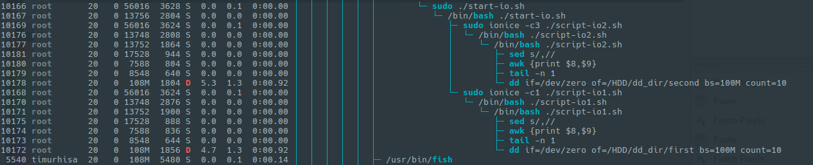
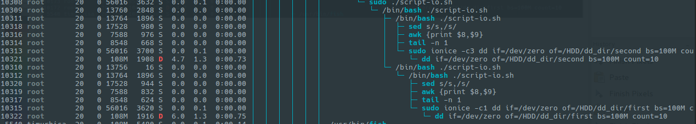
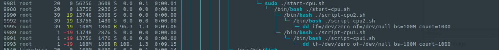
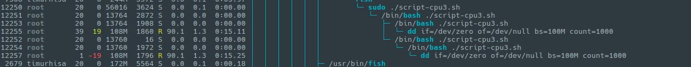

#	4. Реализовать 2 конкурирующих процесса по IO. пробовать запустить с разными ionice
		
## io1/ В данной директории реализован запуск двух шелл оболочек, для паралеллизации процесса
- iostat.log		# лог работы скрипта
- script-io1.sh		# скрипт с изменением приоритета io
- script-io2.sh		# скрипт с изменением приоритета io
- start-io.sh		# скрипт запуска двух вышеприведенных скриптов. Запускается два bash с разным ionice

## io2/ В данной директории реализован запуск двух паралельных процессов через & и функции
Отличие io2 от io1 в том, что запускается один процесс, далее уходит в fg, из него порождается второй процесс.
- iostat.log		# лог работы скрипта
- script-io.sh		# скрипт с двумя функциями, в которых изменен приоритет io

#	5. Реализовать 2 конкурирующих процесса по CPU. пробовать запустить с разными nice

## cpu1/ В данной директории реализован запуск двух шелл оболочек, для паралеллизации процесса
- cpustat.log		# лог работы скрипта
- script-cpu1.sh	# скрипт с изменением приоритета nice
- script-cpu2.sh	# скрипт с изменением приоритета nice
- start-cpu.sh		# скрипт запуска двух вышеприведенных скриптов. Запускается два bash с разным nice

## cpu2/ В данной директории реализован запуск двух паралельных процессов через & и функции

- cpustat.log		# лог работы скрипта
- script-cpu3.sh	# скрипт с двумя функциями, в которых изменен приоритет nice

